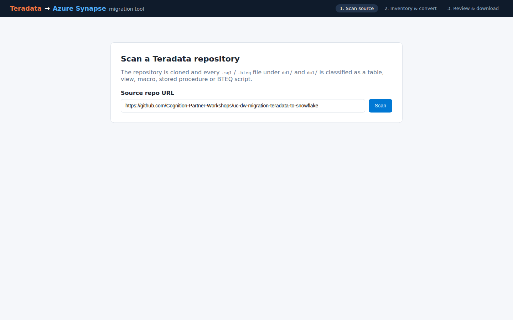
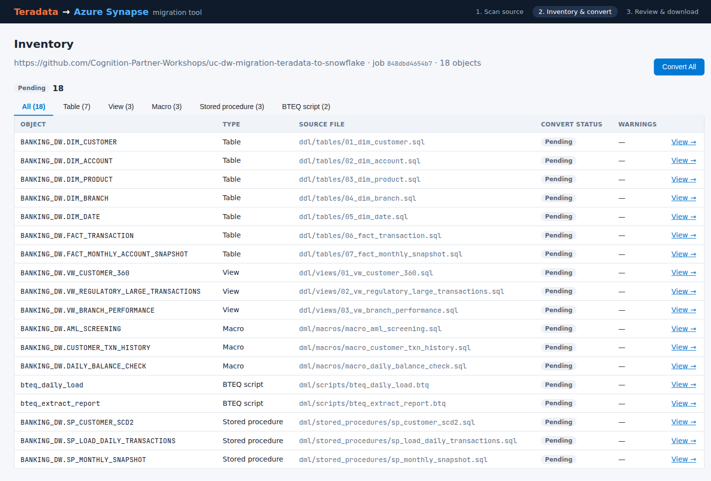
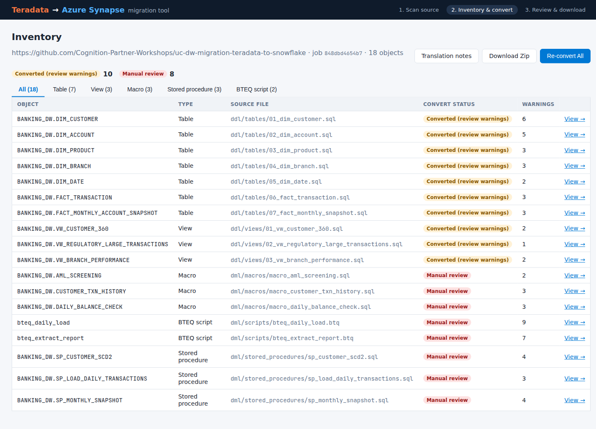
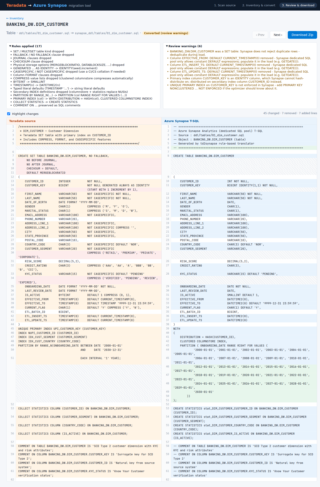
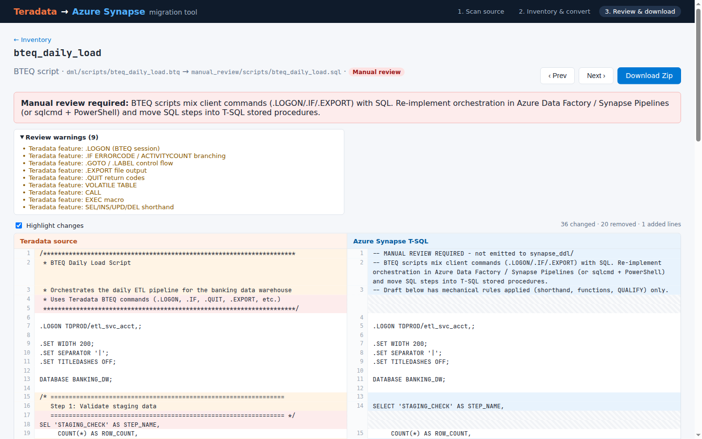

# Teradata → Azure Synapse migration tool

A small, rule-based migration tool that scans a Git repository of Teradata SQL, converts tables and views to
**Azure Synapse Analytics (dedicated SQL pool) T-SQL**, flags everything it cannot convert safely for manual
review, and packages the result as a ZIP.

| Part | Stack | Location |
|---|---|---|
| API + translator | Python 3.10+, FastAPI, SQLite | [`backend/`](backend) |
| UI | React 18 + Vite | [`frontend/`](frontend) |

## Quick start

Prerequisites: Python 3.10+, Node.js 18+, and `git` on the `PATH` (the backend shells out to `git clone`).

### Backend (`uvicorn`)

```bash
cd backend
python -m venv .venv && source .venv/bin/activate   # Windows: .venv\Scripts\activate
pip install -r requirements-dev.txt                  # or requirements.txt for runtime only
uvicorn app.main:app --reload --port 8000
```

Interactive API docs: <http://localhost:8000/docs>.

### Frontend (`npm run dev`)

```bash
cd frontend
npm install
npm run dev            # http://localhost:5173
```

The Vite dev server proxies `/api/*` to `http://localhost:8000` (override with `VITE_BACKEND_URL=...`).

### Tests and lint

```bash
cd backend  && pytest && ruff check . && ruff format --check .
cd frontend && npm test && npm run lint && npm run build
```

## API

| Method | Path | Description |
|---|---|---|
| `POST` | `/jobs` | Body `{"repo_url": "https://github.com/org/repo"}`. Shallow-clones the repo, scans `.sql` / `.bteq` (and `.btq`) files under any `ddl/` or `dml/` directory, and returns the inventory grouped by object type (`table`, `view`, `macro`, `stored_procedure`, `script`). |
| `GET` | `/jobs/{id}` | Current job state and inventory. |
| `POST` | `/jobs/{id}/convert` | Runs the translator. Optional body `{"object_ids": [1, 2]}` converts a subset; no body converts everything. |
| `GET` | `/jobs/{id}/objects/{object_id}` | One object: Teradata source, generated T-SQL, rules applied, warnings, manual-review reason. |
| `GET` | `/jobs/{id}/report` | `SQL_TRANSLATION_NOTES.md` as text. |
| `GET` | `/jobs/{id}/download` | ZIP with `synapse_ddl/`, `manual_review/` drafts and `SQL_TRANSLATION_NOTES.md`. |
| `GET` | `/output/{id}/{path}` | Any generated file under `output/{job_id}/`. |

```bash
JOB=$(curl -s -X POST localhost:8000/jobs -H 'content-type: application/json' \
  -d '{"repo_url":"https://github.com/Cognition-Partner-Workshops/uc-dw-migration-teradata-to-snowflake"}' \
  | python -c 'import json,sys; print(json.load(sys.stdin)["job_id"])')
curl -s -X POST localhost:8000/jobs/$JOB/convert > /dev/null
curl -s -o synapse.zip localhost:8000/jobs/$JOB/download
```

### Storage layout

| Path (relative to `backend/`) | Contents | Env override |
|---|---|---|
| `data/jobs.db` | SQLite: `jobs` and `objects` tables (status, rules, warnings per object) | `TD2S_DB_PATH` |
| `data/sources/{job_id}/` | Shallow clone of the source repo | `TD2S_DATA_DIR` |
| `output/{job_id}/synapse_ddl/` | Converted tables / views, mirroring the source layout | `TD2S_OUTPUT_DIR` |
| `output/{job_id}/manual_review/` | Annotated drafts of macros, procedures and BTEQ scripts | |
| `output/{job_id}/SQL_TRANSLATION_NOTES.md` | Report: summary, manual-review items, per-object rules and warnings | |

Only `http(s)` Git URLs are accepted. Set `TD2S_ALLOW_LOCAL_REPOS=1` to also allow local paths / `file://` URLs (used by the tests).

## Translation rules

Tables and views are converted automatically. Every rule that fires is recorded per object, and anything with a
semantic difference produces a **review warning** (status `converted_with_warnings`).

| Teradata | Azure Synapse |
|---|---|
| `PRIMARY INDEX (col)` / `UNIQUE PRIMARY INDEX (col)` | `WITH (DISTRIBUTION = HASH(col), CLUSTERED COLUMNSTORE INDEX)` (first column of a multi-column PI; falls back to a NUPI column if the PI is an `IDENTITY` column) |
| `NO PRIMARY INDEX` / no PI | `DISTRIBUTION = ROUND_ROBIN` |
| `CREATE SET TABLE` / `CREATE MULTISET TABLE` | `CREATE TABLE` (SET tables get a dedupe-on-load warning) |
| `FALLBACK`, `NO FALLBACK`, `[NO] BEFORE/AFTER JOURNAL`, `CHECKSUM = ...`, `MERGEBLOCKRATIO`, `DATABLOCKSIZE`, ... | dropped |
| `BYTEINT` | `SMALLINT` (Synapse `TINYINT` is unsigned) |
| `TIMESTAMP(n)` / `TIMESTAMP` | `DATETIME2(n)` / `DATETIME2` |
| `CHARACTER SET LATIN/UNICODE`, `[NOT] CASESPECIFIC`, `FORMAT '...'`, `COMPRESS (...)` | dropped |
| `VARCHAR(n)`, `CHAR(n)`, `DECIMAL(p,s)`, `DATE` | kept |
| `INTEGER` | `INT` |
| `GENERATED ALWAYS AS IDENTITY (START WITH s INCREMENT BY i)` | `IDENTITY(s,i)` |
| `PARTITION BY RANGE_N(col BETWEEN DATE 'a' AND DATE 'b' EACH INTERVAL 'n' MONTH)` | `PARTITION (col RANGE RIGHT FOR VALUES (...))` (warns when the partition count is high) |
| `COLLECT STATISTICS COLUMN (c) ON t` | `CREATE STATISTICS stat_t_c ON t (c)` |
| `REPLACE VIEW` | `CREATE VIEW` |
| `SEL` / `INS` / `UPD` / `DEL` | `SELECT` / `INSERT` / `UPDATE` / `DELETE` |
| `... QUALIFY ROW_NUMBER() OVER (...) = 1` | `SELECT q.cols FROM (SELECT ..., ROW_NUMBER() OVER (...) AS qualify_rn ...) AS q WHERE q.qualify_rn = 1` |
| `ZEROIFNULL(x)`, `NULLIFZERO(x)`, `ADD_MONTHS(d, n)`, `CURRENT_DATE ± n`, `x \|\| y`, `HASHROW(...)`, `CSUM`, `MAVG`, `GROUP BY 1, 2` | `ISNULL(x, 0)`, `NULLIF(x, 0)`, `DATEADD(MONTH, n, d)`, `DATEADD(DAY, ±n, CAST(GETDATE() AS DATE))`, `x + y`, `HASHBYTES('SHA2_256', CONCAT(...))`, `SUM() OVER`, `AVG() OVER`, expanded `GROUP BY` |
| `LOCKING ROW FOR ACCESS` | dropped |
| `COMMENT ON ...` | kept as SQL comments |

**Manual review** (status `manual_review`): BTEQ scripts (`.LOGON`, `.IF ... .GOTO`, `.EXPORT`), macros
(`REPLACE MACRO`, `:param` placeholders) and SPL stored procedures (`ACTIVITY_COUNT`, handlers, `VOLATILE`
tables). They are not emitted to `synapse_ddl/`; instead they are listed in `SQL_TRANSLATION_NOTES.md` with the
reason and the Teradata constructs found, and a draft with the mechanical rewrites applied is written to
`manual_review/`.

The rewrites are regex/structure based on top of a small SQL tokenizer that masks string literals and comments
(so e.g. `'SEL x'` is never rewritten). It is not a full SQL parser: always deploy the output to a dev pool and
work through the warnings checklist in `SQL_TRANSLATION_NOTES.md`.

## Walkthrough: converting `BANKING_DW.DIM_CUSTOMER`

The demo source is this repository, [`uc-dw-migration-teradata-to-snowflake`](https://github.com/Cognition-Partner-Workshops/uc-dw-migration-teradata-to-snowflake),
a Teradata `BANKING_DW` warehouse with 7 tables, 3 views, 3 macros, 3 stored procedures and 2 BTEQ scripts.
The screenshots below were captured from the running app against that repository.

### 1. Scan the source repository

Open <http://localhost:5173>. The demo repo URL is pre-filled; click **Scan**.



### 2. Review the inventory

The backend clones the repo and lists every file under `ddl/` and `dml/` with its object type. All 18 objects
start as **Pending**. Use the tabs to filter by type.



### 3. Convert All

Click **Convert All**. The 7 tables and 3 views are converted (with review warnings), the 8 macros / procedures /
BTEQ scripts are marked **Manual review**. **Translation notes** opens `SQL_TRANSLATION_NOTES.md`; **Download Zip**
becomes available.



### 4. Inspect `DIM_CUSTOMER` side by side

Click the `BANKING_DW.DIM_CUSTOMER` row. The split view aligns the Teradata source (left) with the generated
Synapse T-SQL (right); changed lines are highlighted, dropped lines are hatched on the opposite side. Above it are
the rules that fired and the warnings to review.



What happened to this table:

```sql
-- Teradata (ddl/tables/01_dim_customer.sql, abridged)
CREATE SET TABLE BANKING_DW.DIM_CUSTOMER, NO FALLBACK,
     NO BEFORE JOURNAL, NO AFTER JOURNAL, CHECKSUM = DEFAULT, DEFAULT MERGEBLOCKRATIO
(
    CUSTOMER_ID      INTEGER       NOT NULL,
    CUSTOMER_KEY     BIGINT        NOT NULL GENERATED ALWAYS AS IDENTITY
                                   (START WITH 1 INCREMENT BY 1),
    FIRST_NAME       VARCHAR(50)   NOT CASESPECIFIC NOT NULL,
    GENDER           CHAR(1)       COMPRESS ('M', 'F', 'O'),
    IS_ACTIVE        BYTEINT       DEFAULT 1 COMPRESS (0, 1),
    EFFECTIVE_TO     TIMESTAMP(0)  DEFAULT TIMESTAMP '9999-12-31 23:59:59',
    ...
)
UNIQUE PRIMARY INDEX UPI_CUSTOMER_KEY (CUSTOMER_KEY)
INDEX NUPI_CUSTOMER_ID (CUSTOMER_ID)
PARTITION BY RANGE_N(ONBOARDING_DATE BETWEEN DATE '2000-01-01' AND DATE '2030-12-31' EACH INTERVAL '1' YEAR);
COLLECT STATISTICS COLUMN (CUSTOMER_ID) ON BANKING_DW.DIM_CUSTOMER;
```

```sql
-- Azure Synapse (synapse_ddl/tables/01_dim_customer.sql, abridged)
CREATE TABLE BANKING_DW.DIM_CUSTOMER
(
    CUSTOMER_ID                 INT NOT NULL,
    CUSTOMER_KEY                BIGINT IDENTITY(1,1) NOT NULL,
    FIRST_NAME                  VARCHAR(50) NOT NULL,
    GENDER                      CHAR(1),
    IS_ACTIVE                   SMALLINT DEFAULT 1,
    EFFECTIVE_TO                DATETIME2(0) DEFAULT '9999-12-31 23:59:59',
    ...
)
WITH
(
    DISTRIBUTION = HASH(CUSTOMER_ID),
    CLUSTERED COLUMNSTORE INDEX,
    PARTITION ( ONBOARDING_DATE RANGE RIGHT FOR VALUES ('2000-01-01', '2001-01-01', ..., '2030-01-01'))
);
CREATE STATISTICS stat_DIM_CUSTOMER_CUSTOMER_ID ON BANKING_DW.DIM_CUSTOMER (CUSTOMER_ID);
```

Review warnings raised for this table (also in `SQL_TRANSLATION_NOTES.md` as a checklist):

- It was a `SET` table: Synapse does not reject duplicate rows, so deduplicate during load.
- `DEFAULT CURRENT_TIMESTAMP(0)` was removed from `EFFECTIVE_FROM`, `ETL_INSERT_TS` and `ETL_UPDATE_TS`.
  Dedicated SQL pools only allow constant defaults, so populate these columns in the load.
- The UPI column `CUSTOMER_KEY` is an `IDENTITY` column, and Synapse cannot hash-distribute on one. The table is
  distributed on the NUPI column `CUSTOMER_ID` instead.
- The uniqueness of `CUSTOMER_KEY` is not enforced. Add `PRIMARY KEY NONCLUSTERED ... NOT ENFORCED` if the
  optimizer should know about it.

### 5. Manual-review objects

Macros, stored procedures and BTEQ scripts open in the same view with the reason they need a hand rewrite. The
right-hand side is a draft with mechanical rewrites applied, not deployable T-SQL.



### 6. Download

**Download Zip** (inventory or object page) returns:

```
SQL_TRANSLATION_NOTES.md
synapse_ddl/tables/01_dim_customer.sql
synapse_ddl/tables/02_dim_account.sql
...
synapse_ddl/views/03_vw_branch_performance.sql
manual_review/macros/macro_aml_screening.sql
manual_review/scripts/bteq_daily_load.sql
manual_review/stored_procedures/sp_customer_scd2.sql
...
```
